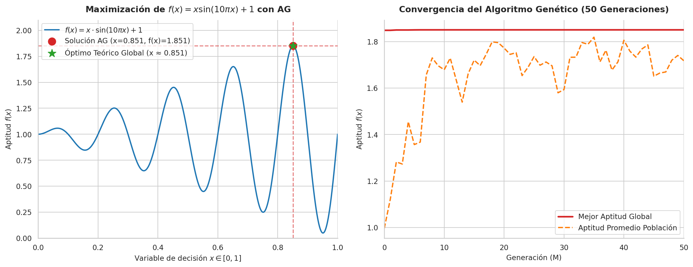

# Optimización Numérica con Algoritmo Genético Simple (AGS)

Este repositorio contiene la implementación y explicación detallada para resolver el problema de maximización de una función matemática no lineal utilizando un **Algoritmo Genético Simple (AGS)** en Python.

---

## 📌 Descripción del Problema

Se desea encontrar el valor de la variable de decisión $x$ que maximiza la función de aptitud $f(x)$:

$$\max f(x) = x \cdot \sin(10\pi x) + 1 \quad \text{sujeto a} \quad x \in [0, 1]$$

### Características de la Función
* **Multi-modalidad:** Presenta múltiples picos y valles (óptimos locales) en el intervalo $[0, 1]$ debido al comportamiento oscilatorio de $\sin(10\pi x)$.
* **Desafío para optimización:** Un algoritmo de búsqueda local tradicional (como el descenso de gradiente) puede quedar atrapado fácilmente en un máximo local. El Algoritmo Genético explora globalmente el espacio de búsqueda.

---

## ⚙️ Metodología del Algoritmo Genético

El problema se resuelve siguiendo la metodología estándar de los Algoritmos Genéticos Simples:

1. **Representación Genotípica (Cromosoma):** Cada individuo (solución candidata) se representa mediante una cadena binaria de $L = 10$ bits (ej. `1101100111`).
2. **Decodificación (Fenotipo):** La cadena binaria se convierte a un valor entero decimal $D \in [0, 1023]$ ($2^{10}-1 = 1023$). Luego, se mapea al espacio continuo $[0, 1]$ mediante:
   $$x = \frac{D}{2^{L} - 1} = \frac{D}{1023}$$
3. **Función de Aptitud (Fitness):** Como el objetivo es maximizar $f(x)$ y $f(x) > 0$ en el dominio $[0,1]$, se evalúa directamente la aptitud como $\text{Aptitud}(x) = f(x)$.
4. **Selección por Ruleta:** La probabilidad de que un cromosoma sea seleccionado como padre es proporcional a su aptitud:
   $$P_i = \frac{f(x_i)}{\sum_{j=1}^{K} f(x_j)}$$
5. **Cruce de un Punto:** Se emparejan los padres y se intercambia su material genético en un punto $k \in [1, L-1]$ seleccionado al azar.
6. **Mutación:** Cada gen se invierte ($0 \rightarrow 1$ o $1 \rightarrow 0$) con una probabilidad $P_M = 0.01$.

---

## 📊 Parámetros de Ejecución

| Parámetro | Símbolo | Valor | Descripción |
| :--- | :---: | :---: | :--- |
| **Tamaño de Población** | $K$ | `30` | Número de individuos por generación |
| **Longitud del Cromosoma** | $L$ | `10 bits` | Resolución discreta ($1024$ estados) |
| **Número de Generaciones** | $M$ | `50` | Criterio de parada |
| **Probabilidad de Mutación** | $P_M$ | `0.01` | Tasa de mutación por bit |
| **Semilla Aleatoria** | `SEMILLA` | `3` | Asegura la reproducibilidad del experimento |

---

## 🐍 Código Fuente en Python

```python
import math
import random

# ============================================================
# 1. PARÁMETROS DEL ALGORITMO GENÉTICO
# ============================================================
SEMILLA = 3
K = 30          # Número de individuos de la población
L = 10          # Número de bits por cromosoma
M = 50          # Número de generaciones
PM = 0.01       # Probabilidad de mutación

# ============================================================
# 2. FUNCIÓN OBJETIVO Y DECODIFICACIÓN
# ============================================================
def funcion_objetivo(x):
    return x * math.sin(10 * math.pi * x) + 1

def decodificar(cromosoma):
    cadena_binaria = "".join(map(str, cromosoma))
    D = int(cadena_binaria, 2)
    x = D / (2**L - 1)
    return x

def evaluar_aptitud(cromosoma):
    x = decodificar(cromosoma)
    return funcion_objetivo(x)

def evaluar_poblacion(poblacion):
    return [evaluar_aptitud(c) for c in poblacion]

# ============================================================
# 3. OPERADORES GENÉTICOS
# ============================================================
def generar_poblacion():
    return [[random.randint(0, 1) for _ in range(L)] for _ in range(K)]

def seleccion_ruleta(poblacion, aptitudes):
    aptitud_total = sum(aptitudes)
    probabilidades = [a / aptitud_total for a in aptitudes]
    acumuladas = []
    suma = 0
    for p in probabilidades:
        suma += p
        acumuladas.append(suma)
    
    padres = []
    for _ in range(K):
        r = random.random()
        for i in range(K):
            if r <= acumuladas[i]:
                padres.append(poblacion[i][:])
                break
    return padres

def cruce_un_punto(padre1, padre2):
    punto = random.randint(1, L - 1)
    hijo1 = padre1[:punto] + padre2[punto:]
    hijo2 = padre2[:punto] + padre1[punto:]
    return hijo1, hijo2

def mutar(cromosoma):
    hijo = cromosoma[:]
    for i in range(L):
        if random.random() < PM:
            hijo[i] = 1 - hijo[i]
    return hijo

# ============================================================
# 4. CICLO EVOLUTIVO PRINCIPAL
# ============================================================
def ejecutar_algoritmo_genetico():
    random.seed(SEMILLA)
    poblacion = generar_poblacion()
    
    mejor_global = None
    mejor_aptitud_global = float("-inf")
    historial_mejor = []
    historial_promedio = []

    for generacion in range(M + 1):
        aptitudes = evaluar_poblacion(poblacion)
        indice_mejor = max(range(K), key=lambda i: aptitudes[i])
        mejor_generacion = poblacion[indice_mejor][:]
        aptitud_mejor_generacion = aptitudes[indice_mejor]
        promedio = sum(aptitudes) / K

        if aptitud_mejor_generacion > mejor_aptitud_global:
            mejor_aptitud_global = aptitud_mejor_generacion
            mejor_global = mejor_generacion[:]

        historial_mejor.append(mejor_aptitud_global)
        historial_promedio.append(promedio)

        if generacion == M:
            break

        # Operadores
        padres = seleccion_ruleta(poblacion, aptitudes)
        nueva_poblacion = []
        for i in range(0, K, 2):
            h1, h2 = cruce_un_punto(padres[i], padres[i+1])
            nueva_poblacion.append(mutar(h1))
            nueva_poblacion.append(mutar(h2))
        poblacion = nueva_poblacion

    return mejor_global, mejor_aptitud_global, historial_mejor, historial_promedio

# Ejecución
mejor_cromosoma, mejor_aptitud, h_mejor, h_prom = ejecutar_algoritmo_genetico()
x_mejor = decodificar(mejor_cromosoma)

print(f"Cromosoma Óptimo : {''.join(map(str, mejor_cromosoma))}")
print(f"Valor de x        : {x_mejor:.6f}")
print(f"Aptitud f(x)      : {mejor_aptitud:.6f}")
```

---

## 📈 Resultados y Obtención de la Solución

Al ejecutar el algoritmo durante 50 generaciones, se obtuvieron los siguientes resultados:

* **Cromosoma Binario Óptimo:** `1101100111`
* **Valor Decimal ($D$):** $871$
* **Valor de $x$ encontrado por el AG ($x_{AG}$):** $0.8514173998 \approx 0.8514$
* **Valor Máximo de Aptitud ($f(x_{AG})$):** $1.850573$

### Verificación del Rendimiento
1. **Óptimo Matemático Continuo:** $x^* \approx 0.851185 \quad \Rightarrow \quad f(x^*) \approx 1.850595$.
2. **Evaluación Exhaustiva Discreta ($2^{10} = 1024$ estados):** El valor $D = 871$ ($x \approx 0.851417$) es la **mejor representación discreta posible dentro de la resolución de 10 bits**.
3. **Conclusión:** El AG encontró con precisión la mejor solución alcanzable dentro del espacio codificado de 10 bits.

---

## 🎨 Visualización de la Solución y Convergencia

La siguiente gráfica ilustra:
1. La curva de $f(x)$ marcando la **solución encontrada por el AG** ($x=0.851, f(x)=1.851$) frente al óptimo global teórico.
2. La **curva de convergencia** a lo largo de las 50 generaciones, observando el crecimiento de la aptitud promedio de la población y la estabilidad de la mejor aptitud.


